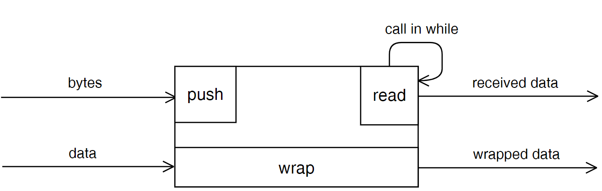
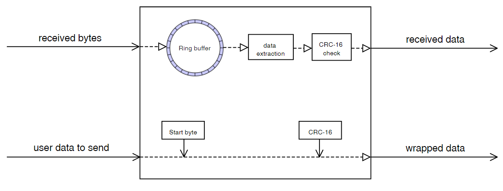
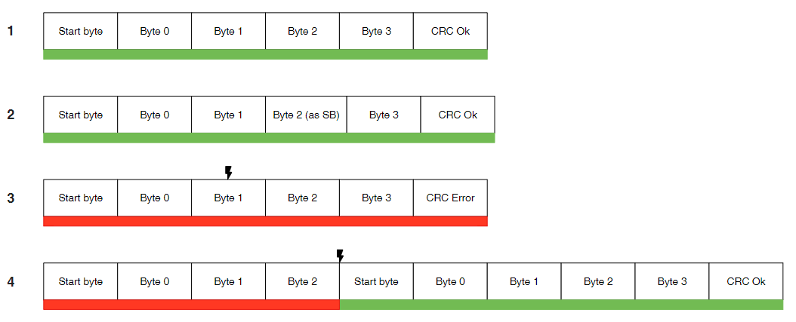

# Sheller integrity guarantee 
Special version of Sheller for using with Arduino. [Original Sheller](https://github.com/VNovytskyi/Sheller)

  

## Overview
Library design for organization package data exchange with integrity guarantee.
The package consists of Start-byte, a label for begin parsing package and several bytes of Cyclic redundancy check CRC-16 (CRC-byte) for integrity determination. 
Struct of package:

The library use CRC-16, therefore, the amount of CRC bytes is 2, and the maximum length of user data is 4095 bytes. 
Preset value of user data is 8 bytes. Eventually, 8 bytes useful bytes plus 3 service bytes. To speed up processing the CRC is using the table method.
The size of the CRC table is 512 bytes. Interaction with this library going through 3 functions: wrap, push, read:

## Internal logic

Sheller assumes work in communication channels with a high influence of interference. Functioning under such conditions is achieved by a State-machine, which is used for byte-by-byte data reception and a checksum algorithm.  

## Test cases
The illustration below shows examples of the effect of interference on transmitted packets:

In the first case, the package reached the recipient without damage. 
The second case demonstrates that Sheller does not impose restrictions on the transmitted data. The user data may contain service bytes. 
In the third case, the interference changed the value of the second byte. As a result, the checksum was not converged on the receiving side and the packet was not transferred to the business logic. 
In the fourth case, part of the package was lost due to interference or lack of contact. The checksum did not agree on the receiving side. In this case, a search was performed for the next initial byte, followed by the similarity of the checksum and the transfer of the packet to the business logic of the application.  
